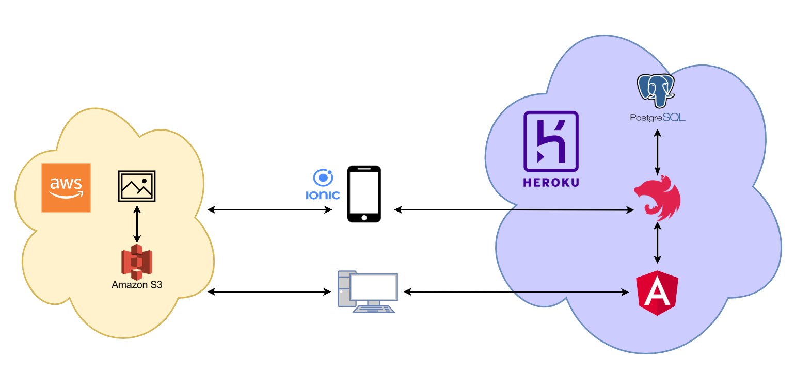

  

# Frontend

O presente repositório foi empregado na criação do backend da aplicação "Entrega pra mim". O framework NestJs é a tecnologia usado para criar o servidor que atenderá as requisições dos usuários e o Swagger foi utilizado para documentar e testar API REST. A infraestrutura foi provisionado pelos serviços do Heroku e as imagens armazenadas no S3 AWS. O sistema gerencial é baseado em Angular, a autenticação e autorização das sessões dos usuários é feito através dos tokens JWT. Os clientes da solução de delivery consumirá os serviços através de um aplicativo móvel desenvolvido em Ionic.

## Modelagem Entidade-Relacionamento

## Arquitetura do Sistema

## Painel do Heroku

## Bucket AWS S3

## Swagger

# Licença

Este projeto está sob licença privada © 2021 Adriana Cardoso. Para mais informações acesse o arquivo :scroll:`LICENSE.md`.
